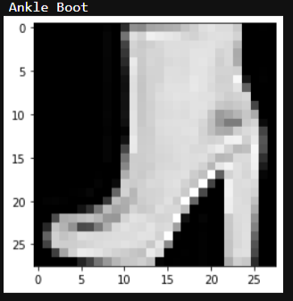
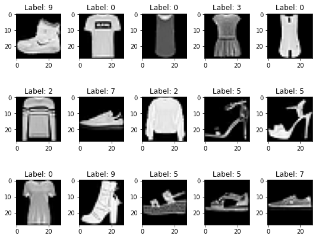
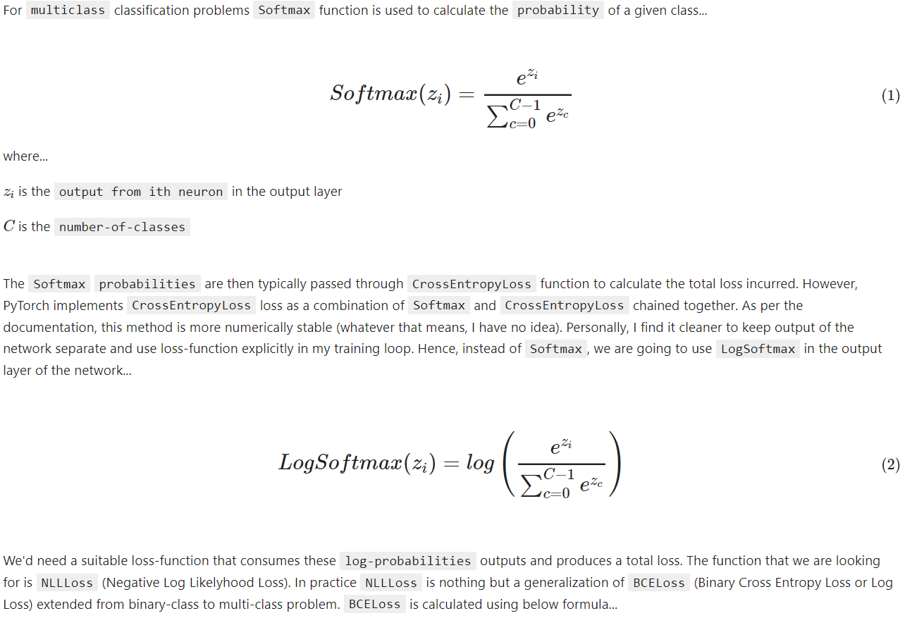
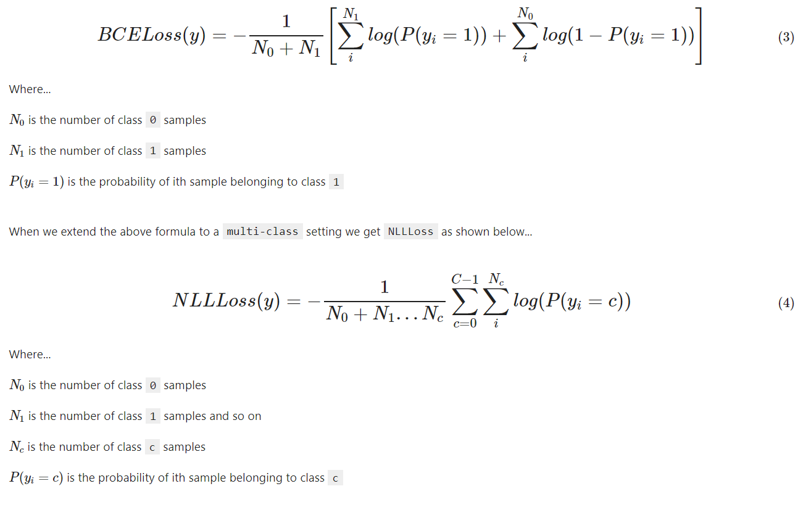
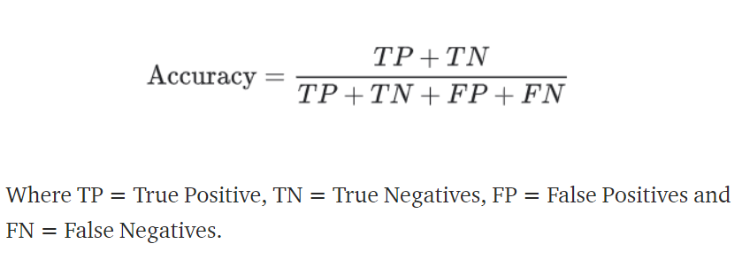
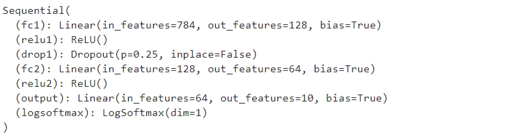
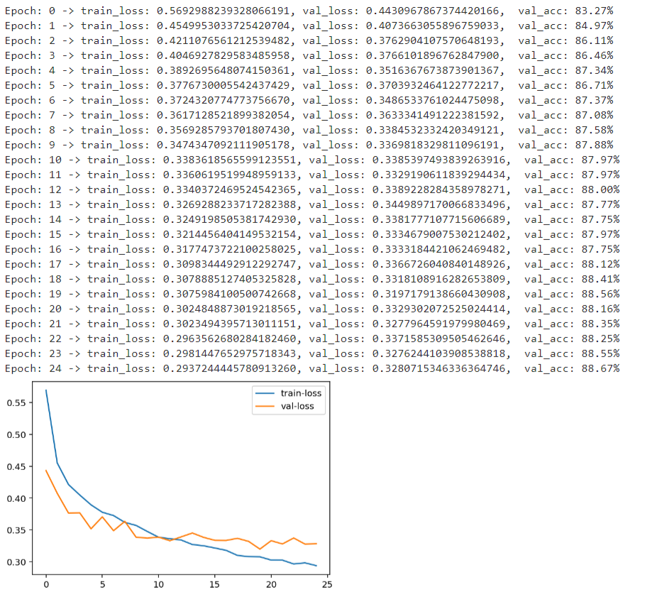
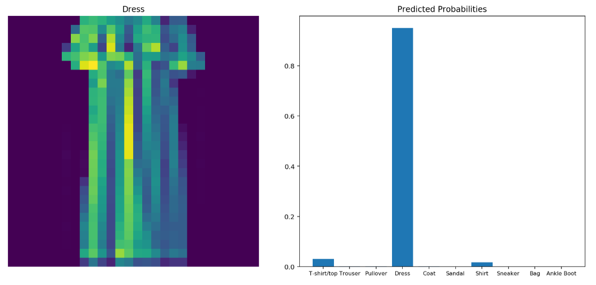
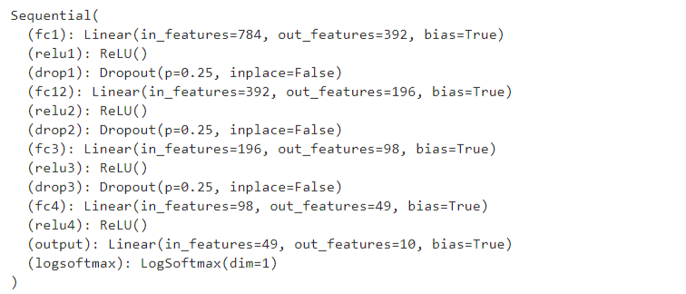
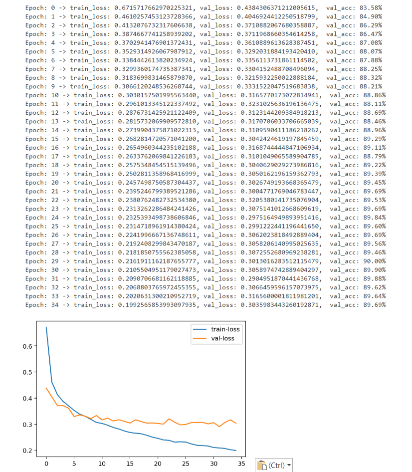

# Fashion MNIST Classification using Neural Network 


### Classify apparel images in Fashion-MNIST dataset


## Table of Contents

- [Introduction](#introduction) 
- [Objective](#objective)
- [Dataset](#dataset)
- [Evaluation Criteria](#evaluation-criteria)
- [Solution Approach](#solution-approach)
- [How To Use](#how-to-use)
- [License](#license)
- [Author Info](#author-info)


## Introduction
Just like [MNIST digit classification](https://github.com/sssingh/hand-written-digit-classification) the [Fashion-MNIST dataset](https://github.com/zalandoresearch/fashion-mnist) is a very popular datasets for classification in Machine Learning community for building and testing neural networks. MNIST is actually quite trivial dataset to be used with neural networks where one can achieve better than 97% accuracy easily. Experts recommend ([Ian Goodfellow](https://twitter.com/goodfellow_ian/status/852591106655043584), [François Chollet](https://twitter.com/fchollet/status/852594987527045120)) to move away from MNIST dataset for model benchmarking and validation. Fashion-MNIST is more complex than MNIST and its a much better dataset for evaluating models compare to MNIST.


---
## Objective
We'll build a neural network using PyTorch. Only `fully-connected` layers will be used. Goal here is to classify 10 classes of apparel images in Fashion-MNIST dataset with as high accuracy as possible by only using fully-connected layers (i.e. without using `Convolution` layers)

---
## Dataset
- Dataset consists on 60,000 training images and 10,000 testing images.
- Every image in the dataset will belong to one of the 10 classes...

| Label	| Description |
|--- | ---|
|0|	T-shirt/top|
|1|	Trouser|
|2|	Pullover|
|3|	Dress|
|4|	Coat|
|5|	Sandal|
|6|	Shirt|
|7|	Sneaker|
|8|	Bag|
|9|	Ankle boot|

- Each image in the dataset is 28x28 pixel gray scale image, a zoomed in single images shown below...




- Here are zoomed out samples of other images from the training dataset with their respective labels...




- We will use the in-built Fashion-MNIST dataset from PyTorch's `torchvision` package. The advantage of of using the dataset this way is that we get a clean pre-processed dataset which pairs the image and respective label nicely making our life easier when we iterate through the image samples while training and testing the model. Alternatively the raw dataset can be downloaded from the original source, Just like MNIST the raw dataset comes as a set of 4 zip files containing training images, training image labels, testing images and testing image labels in separate files... 
[train-images](http://fashion-mnist.s3-website.eu-central-1.amazonaws.com/train-images-idx3-ubyte.gz), 
[train-labels](http://fashion-mnist.s3-website.eu-central-1.amazonaws.com/train-labels-idx1-ubyte.gz), 
[test-images](http://fashion-mnist.s3-website.eu-central-1.amazonaws.com/t10k-images-idx3-ubyte.gz), 
[test-labels](http://fashion-mnist.s3-website.eu-central-1.amazonaws.com/t10k-labels-idx1-ubyte.gz)

---

## Evaluation Criteria

### Loss Function  
Negative Log Likelyhood Loss (NLLLoss) is used as the loss function during model training and validation 





<br>Note the `negative` sign in front `NLLLoss` formula (and in `BCELoss` formula as well) hence negative in the name. Negative sign is put in front to make the overall average loss positive. If we don't do this then, since `log` of a number less than 1 is negative, we will end-up with negative overall average loss which means in order to reduce the loss we need to `maximize` the loss function instead of `minimizing` which is a much easier task mathematically than `maximizing`.


### Performance Metric

`accuracy` is used as the model's performance metric on the test-set 



---
## Solution Approach
- Training dataset of 60,000 images and labels along with testing dataset of 10,000 images and labels are downloaded from torchvision.
- Training dataset is then further split into training (80% i.e. 48,000 samples) and validation (20% i.e. 12,000) samples sets
- The training, validation and testing datasets are then wrapped in PyTorch `DataLoaders` objects so that we can iterate through them with ease. A `batch_size` of 64 is used.
- The neural network is implemented using `Sequential` wrapper class from PyTorch `nn` module. 
- We start with exactly same simple network that we used with MNIST dataset, network is defined to have... 
    - The implicit input layer has a size of 784 (28x28 flattened)
    - The first hidden layer has 784 input and produces 128 `ReLU` activated outputs
    - A dropout layer with 25% probability
    - The second hidden layer has 128 input and produces 64 `ReLU` activated outputs
    - A dropout layer with 25% probability
    - Output layer has 64 input and produces 10 logits outputs Corresponding to each of the 10 classes in the dataset). Logits are then passed through `LogSoftmax` activation to get `log-probability` for each of the classes. 


    
- Network is then trained for 25 epochs using `NLLLoss` loss function and `Adam` optimizer with a learning-rate of `0.003`.
- We keep track of training loss and plot it, we observe training loss decreasing throughout but validation loss does not improve further after 11-12 epochs...



- We have a trained model, lets try classifying a single image from test set. 



- We observe that network is able to identify the image with high degree of accuracy. This looks good, lets evaluate our trained network on complete test set. We managed get a prediction `accuracy` of `87.42%` which is not bad given the fact that our model is a very simple neural-net.

- In order to improve prediction accuracy we add few more fully-connected layers with dropouts. Modified model architecture is shown below...



- We then re-train the new model for 35 epochs using `NLLLoss` loss function and `Adam` optimizer with a learning-rate of `0.0007`. 
- We keep track of training and validation losses and plot them. We observe that the modified model is able to produce lower validation loss compared to previous model



- We then evaluate our trained network on complete the test set. This time we managed get a prediction `accuracy` of `88.65%` which is an improvement of more than a percent over previous model.
- Its very well possible to improve model performance and push it above 90% by further experimenting with the architecture and tuning hyperparameters. However, it'd be very hard to get the accuracy in range of 95-98% using a model just utilizing fully connected layers. Reason for this is that Fashion-MNIST is more complex dataset compare to MNIST. When images of 28x28 are flattened to make them a vector of 784 elements so that they could feed to a fully connected layer they loose `spatial` structural information hence model ability to learn the underlying structure is reduced.
- Instead of fully-connected layers if we were to use `Convolution` layers that could consume 28x28 images directly preserving the `spatial` structural information then it'd be pretty easy to obtain accuracy in excess of 95%.


---
## How To Use
1. Ensure below listed packages are installed
    - `numpy`
    - `matplotlib`
    - `torch`
    - `torchvision`
2. Download `fashion_mnist_classification_nn_pytorch.ipynb` jupyter notebook from this repo
3. Execute the notebook from start to finish in one go. If a GPU is available (recommended) then it'll use it automatically else it'll fall back to CPU. 
4. On a machine with `NVIDIA Quadro P5000` GPU with 16GB memory it approximately takes 15 minutes to train and validate for 35 epochs.
5. A trained model can be used to make prediction as shown below...

```python
    # Flatten the image to make it 784 1D tensor
    image = image.view(image.shape[0], -1)
    # Predict and get probabilities
    proba = torch.exp(model(image))
    # Extract the most likely predicted class
    _, pred_label = torch.max(proba, dim=1)
    print(pred_label)
```

---
## License

MIT License

Copyright (c) [2021] [Sunil S. Singh]

Permission is hereby granted, free of charge, to any person obtaining a copy
of this software and associated documentation files (the "Software"), to deal
in the Software without restriction, including without limitation the rights
to use, copy, modify, merge, publish, distribute, sublicense, and/or sell
copies of the Software, and to permit persons to whom the Software is
furnished to do so, subject to the following conditions:

The above copyright notice and this permission notice shall be included in all
copies or substantial portions of the Software.

THE SOFTWARE IS PROVIDED "AS IS", WITHOUT WARRANTY OF ANY KIND, EXPRESS OR
IMPLIED, INCLUDING BUT NOT LIMITED TO THE WARRANTIES OF MERCHANTABILITY,
FITNESS FOR A PARTICULAR PURPOSE AND NONINFRINGEMENT. IN NO EVENT SHALL THE
AUTHORS OR COPYRIGHT HOLDERS BE LIABLE FOR ANY CLAIM, DAMAGES OR OTHER
LIABILITY, WHETHER IN AN ACTION OF CONTRACT, TORT OR OTHERWISE, ARISING FROM,
OUT OF OR IN CONNECTION WITH THE SOFTWARE OR THE USE OR OTHER DEALINGS IN THE
SOFTWARE.

---

## Author Info

- Twitter - [@sunilssingh6](https://twitter.com/sunilssingh6)
- Linkedin - [Sunil S. Singh](https://linkedin.com/in/sssingh)
---
